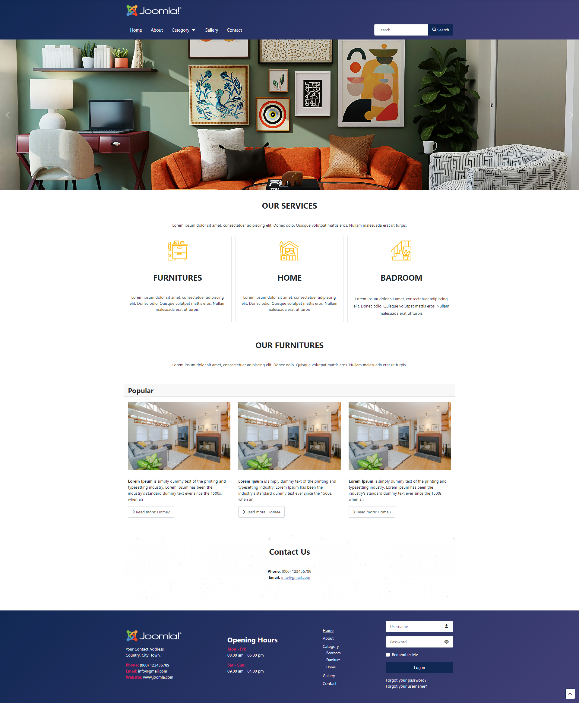
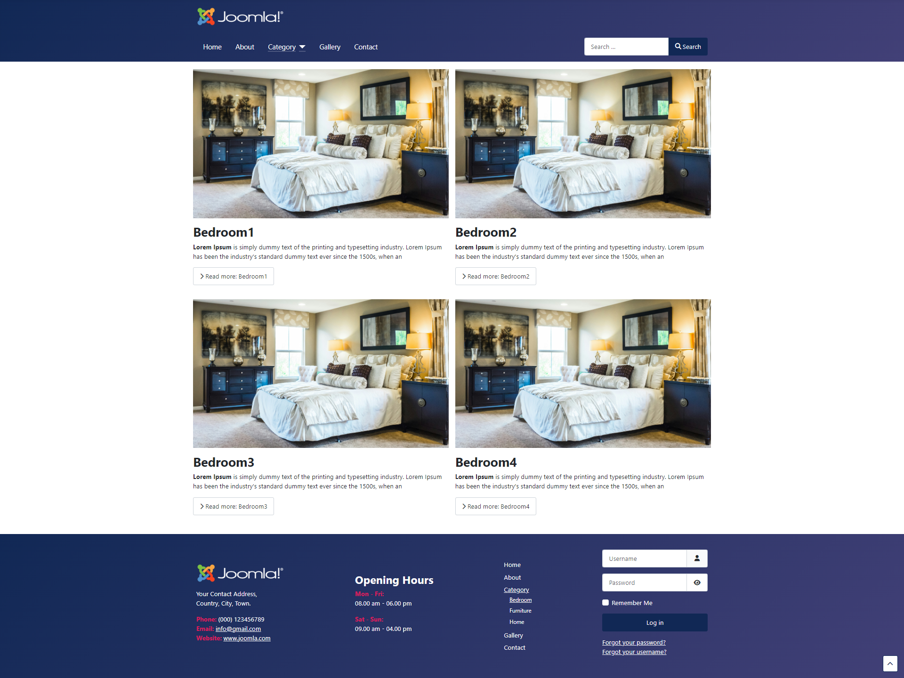
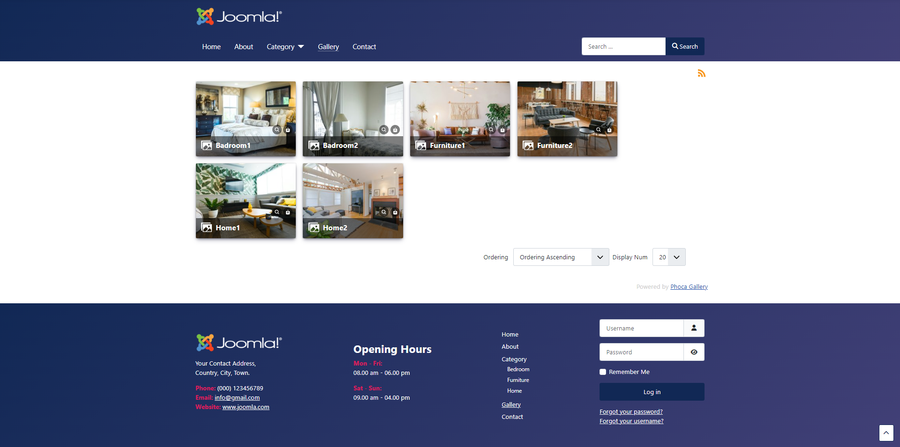
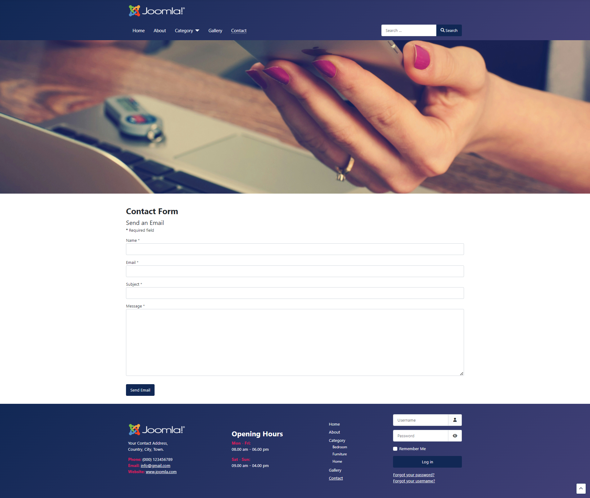

# Furniture Website

Create furniture website with using:

- Joomla version 5
- JCE Editor (Extension)
- Smart Slider 3 (Extension)
- Phoca Gallery (Extension)

 

How to install this project

1. create database
2. import 'joomla_db.sql' in database
3. download wordpress form [https://downloads.joomla.org/](https://downloads.joomla.org/).
4. login
   - user: admin
   - password: admin31012545

## Home page
 

 

## About page
 

 

## Category page
 

 

## Bedroom page
 

 

## Gallery page
 

 

## Contact page
 

